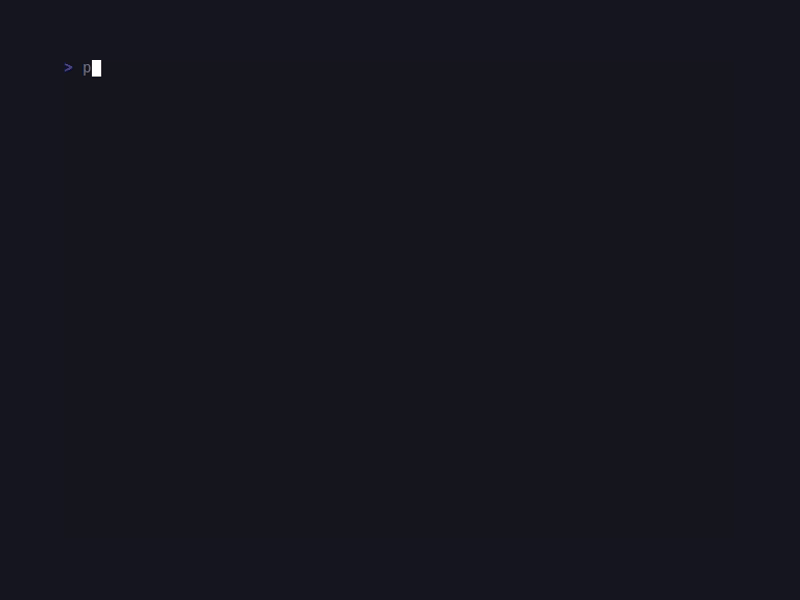

# CandyKit

<!-- BADGES:BEGIN -->
[](https://github.com/detain/sugarcraft/actions/workflows/ci.yml)
[](https://app.codecov.io/gh/detain/sugarcraft?flags%5B0%5D=candy-kit)
[](https://packagist.org/packages/sugarcraft/candy-kit)
[](LICENSE)
[](https://www.php.net/)
<!-- BADGES:END -->



```sh
composer require sugarcraft/candy-kit
```

PHP port of [charmbracelet/fang](https://github.com/charmbracelet/fang) —
opinionated **CLI presentation helpers** that turn ordinary command-
line output into something that matches the rest of the SugarCraft
stack. CandyKit is library-only — drop it into any Composer project,
no Symfony Console requirement.

```php
use SugarCraft\Kit\StatusLine;
use SugarCraft\Kit\Banner;
use SugarCraft\Kit\Theme;

echo Banner::title('CandyApp', 'v0.1.0'), "\n\n";
echo StatusLine::info('connecting to https://example.com'), "\n";
echo StatusLine::success('done in 0.4s'), "\n";
echo StatusLine::warn('disk almost full'), "\n";
echo StatusLine::error('connection refused'), "\n";
```

## Components

- **`Theme`** — palette of `Sprinkles\Style` objects keyed by status
  level (success / error / warn / info / prompt / accent / muted).
  `Theme::ansi()` ships the colourful palette; bring your own theme by
  passing styles to the constructor (or `Theme::build()`).
  `Theme::detect()` is the `ansi()` palette downgraded to what the output
  can show, via candy-core's `ColorProfile::detect()`: no escape bytes at
  all when STDOUT is not a tty (`myapp --help | less`), colour dropped but
  bold kept under `NO_COLOR`, full colour forced by `CLICOLOR_FORCE` /
  `FORCE_COLOR`. Known gap: candy-core checks `NO_COLOR` *before* tty-ness
  (upstream `colorprofile` checks tty-ness first), so a pipe with
  `NO_COLOR` set still gets bold/faint SGR — never colour — until that
  order is fixed in candy-core. **Every presenter called without a theme uses
  `Theme::detect()`**; an explicitly passed theme is rendered as given —
  apply the same downgrade to any preset with
  `$theme->withColorProfile(ColorProfile::detect(null, STDOUT))`.
- **`StatusLine`** — `success` / `error` / `warn` / `info` static
  helpers returning a glyph + message string styled per the active
  theme.
- **`Banner`** — render a bordered title block with optional subtitle,
  rounded by default. Useful for app intros / `--version` output.
- **`Logo`** — ASCII-art logo renderer with `Logo::sugarcraft()` built-in
  preset and `Logo::fromAscii($art)` for custom art. Chain
  `->withColor($hex)` to apply foreground color.
- **`Section`** — one-line themed dividers: `header()` label + fill rule,
  bare `rule()`, and indented `subHeader()` for nesting under a parent.
  An explicit `width` is a hard cap: an over-long label is cut with `…`
  rather than overflowing the line.
- **`Stage`** — per-line step renderers for progressive CLI output:
  `step()` (numbered), `subStep()`, and `subStepWithProgress()` (bar or spinner).
- **`HelpText`** — fang-style `--help` page: `USAGE`, an optional
  description, and titled two-column `KEY  description` sections.
  Wraps to `width` (default 80, `null` = never wrap): long descriptions
  continue at the description column, and switch to a stacked layout
  (description under the key) when the key column leaves fewer than 16
  cells.
- **`Frame`** — full-screen application chrome: a double-line box that
  fills the terminal exactly (`Frame::new()->withTitle($bar)
  ->withStatus($bar)->render($body, $cols, $rows)`), with a centred title
  bar, dividers, and a status bar. Normalises the body to a constant line
  count and pads ANSI-width-aware so it never overflows the terminal —
  safe for a TEA program whose frame-diff renderer owns the screen.

## Demos

### CLI page


## Test

```sh
cd candy-kit && composer install && vendor/bin/phpunit
```

## Snapshot tests

Presenter output is pinned via `candy-testing`'s `assertGoldenAnsi` golden-file
snapshots. Any change to the ANSI slide output must be intentional — re-record
the fixtures with `UPDATE_GOLDENS=1 vendor/bin/phpunit` to accept a new
canonical render.
